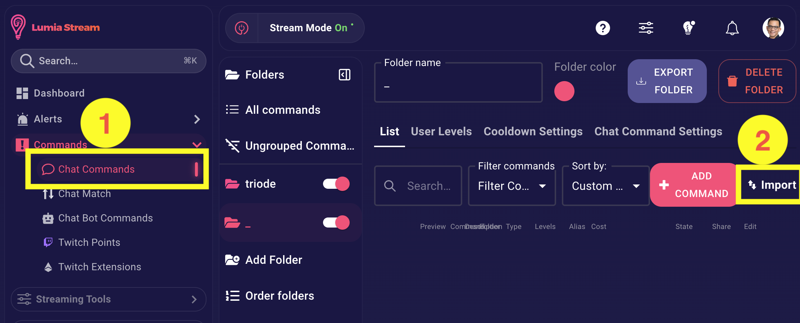
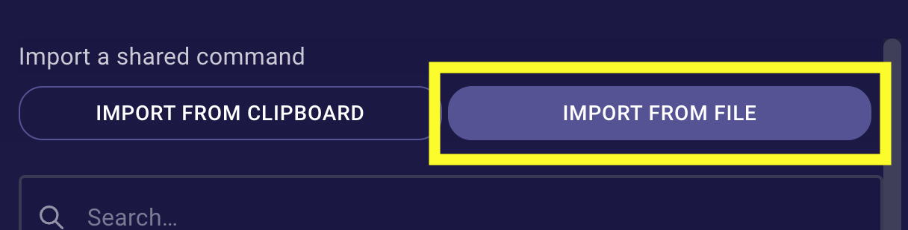
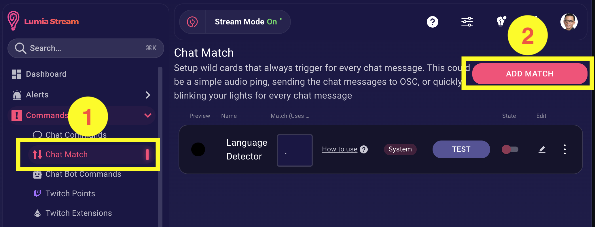
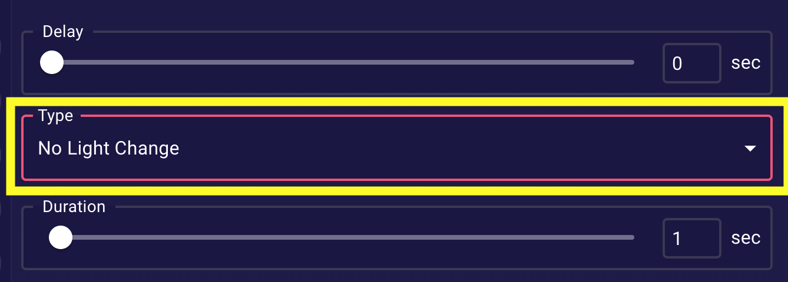
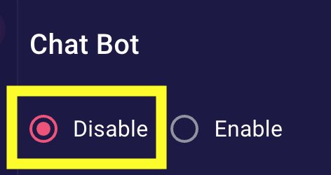
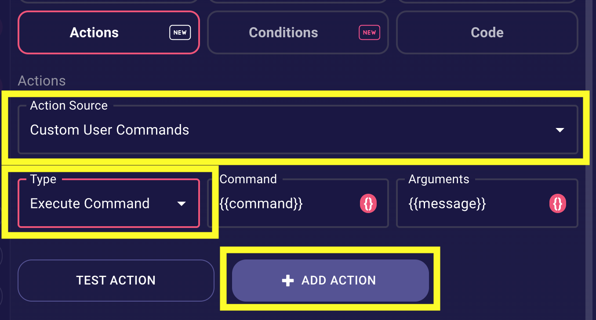
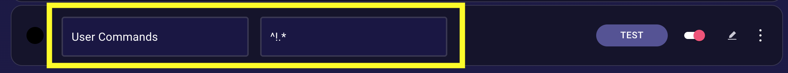
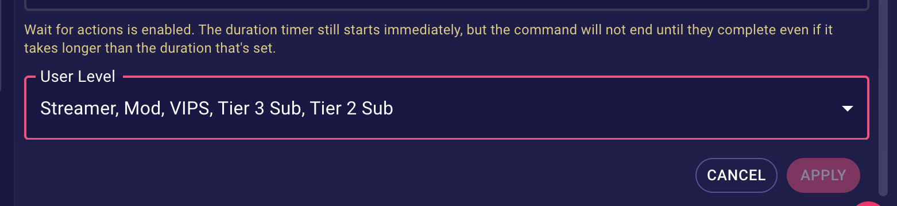

## Setup

**Step 1:** Download the chat command file: 
[command_command.lumia](https://github.com/chrisle/lumia-stream/raw/main/user-commands/extra/command_command.lumia)

**Step 2:** Go to Chat Commands and click Import

**Step 3:** Click "Import from file" and select the file you downloaded

**Step 4:** A new `!command` chat command will be added

**Step 5:** Go to Chat Match and add a new match

**Step 6:** Disable "Show this command in the !commands page"

**Step 7:** Set Light Change to "No Light Change"

**Step 8:** Go to Chatbot and disable it

**Step 9:** Go to Actions. Set "Action Source" to "Custom User Commands" and "Type" to "Execute Command" (everything else will be set automatically). Then click "Add Action".

**Step 10:** Click "Apply"

**Step 11:** Name it `User Commands` and set the match to `^!.*`

---

## Customizing

By default only VIPs, Tier 2, Tier 3, and Mods can create commands. To change this, edit the chat command and adjust the User Level settings.

---

## Usage

- `!command add <name> <response>` - Create a command
- `!command edit <name> <response>` - Edit a command
- `!command delete <name>` - Delete a command
- `!command list` - List all commands

**Supported Variables in Responses:**
- `{{displayname}}` - Display name of the user who triggered the command
- `{{message}}` - Arguments passed to the command

Note: Only these two variables are allowed in custom command responses.
